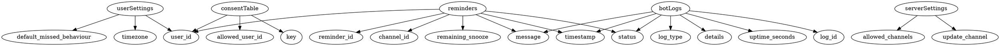

# V1/Alpha

## Features
Technical Features
- First Class Docker/Kubernetes Support
- Support MySQL and Postgres

User Features
- Allow users to set reminders
- Allow users to modify reminders
- Allow users to delete reminders
- Allow users to add consenting users to reminders
- Allow users to mention only consenting users in reminders
- Allow users to remove consent from others
- Allow users to set per server settings
- Allow users to snooze reminders
- Allow users to view bot status
- Allow users to snooze reminders

Server Admin Features
- Allow server admins to set permitted channels
- Allow server admins to remove permitted channels
- Allow server admins to designate a channel to get bot updates to

Bot Admin Features
- Allow bot admins to view bot logs
- Allow bot admins to check more in depth things and restart bot

## Database Structure
- Reminders table
- User settings table
- Server settings table

preliminary simplified ERD

## Permission logic and roles
everyone is a user
people with administrator permission in a role are considered Server admins
people defined via container argument discord user id are Bot admins

## Needed commands

### User commands:
- create reminder
- edit reminder
- delete reminder
- consent to getting pinged
- remove consent to getting pinged
- set timezone
- default missed behaviour
- Get Bot status
- snooze reminder

### Server Admin Commands:
- add reminding channel(s)
- remove reminding channel(s)
- set update channel
- remove update channel

### Bot Admin Commands:
- View bot logs
- Restart Bot
